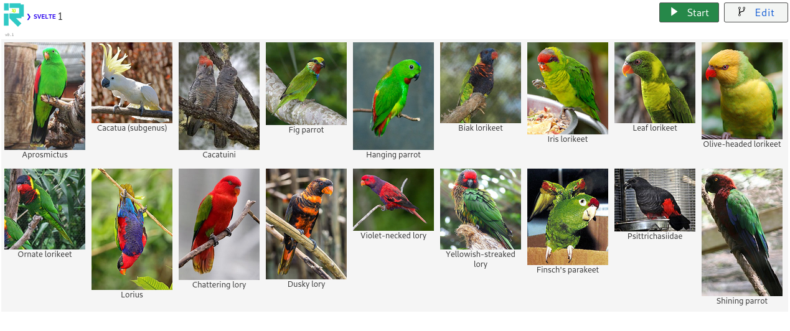
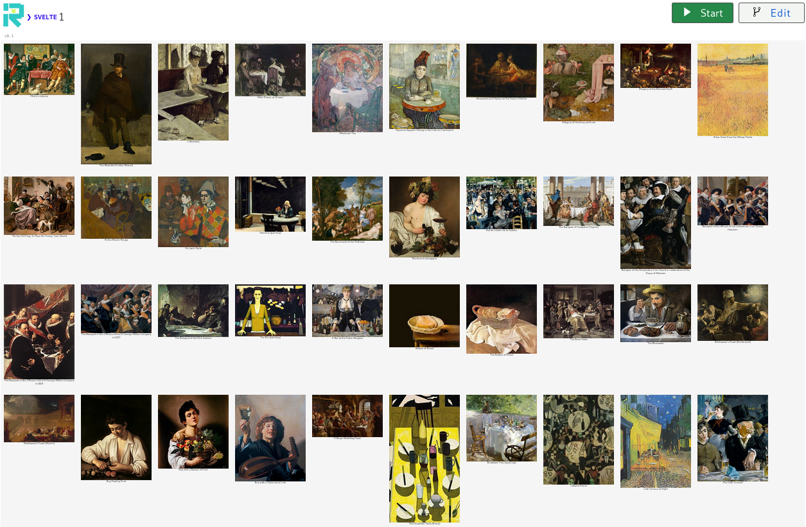
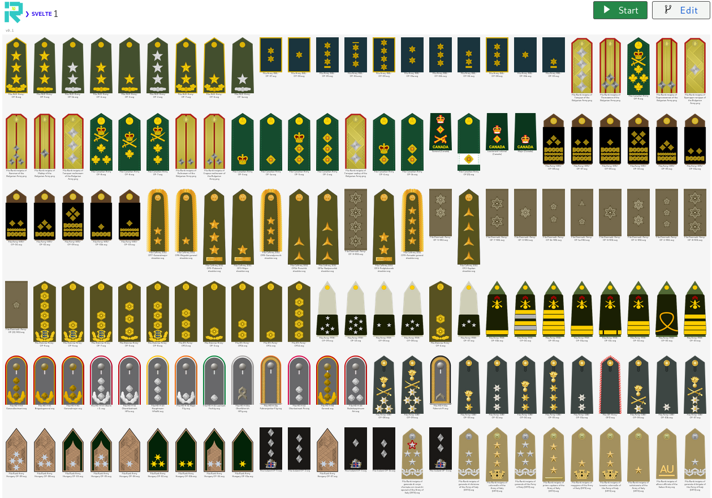

# Rutynka Svelte binary quiz


This is a Svelte quiz type for [Rutynka](https://rutynka.io) apps.

## Stand-alone live demo on [surge](https://rutynka-svelte-binary-quiz.surge.sh)


---

## Get started

Clone and install the dependencies...

```bash
npx degit rutynka/routine-svelte-quiz#master routine-svelte-binary-quiz.git
cd routine-svelte-quiz
yarn install
```

https://betterstack.dev/blog/npm-package-best-practices/
...then start [Rollup](https://rollupjs.org):

```bash
yarn dev
```

Navigate to [localhost:5000](http://localhost:5000). You should see your app running. Edit a component file in `src`, save it, and reload the page to see your changes.

By default, the server will only respond to requests from localhost. To allow connections from other computers, edit the `sirv` commands in package.json to include the option `--host 0.0.0.0`.

## Get more data from [Rutynka](https://rutynka.io)






https://public.rutynka.io/beta-testers/silly_hodgkin/14-Rabbit_breeds_originating_in_the_United_States.html
https://public.rutynka.io/beta-testers/silly_hodgkin/19-Dog_fighting_breeds.html

https://public.rutynka.io/beta-testers/silly_hodgkin/14-Rabbit_breeds_originating_in_the_United_States.json
https://public.rutynka.io/beta-testers/silly_hodgkin/19-Dog_fighting_breeds.json

## Building and running in production mode

To create an optimised version of the app:

```bash
npm run build
```

You can run the newly built app with `npm run start`. This uses [sirv](https://github.com/lukeed/sirv), which is included in your package.json's `dependencies` so that the app will work when you deploy to platforms like [Heroku](https://heroku.com).

## Single-page app mode

By default, sirv will only respond to requests that match files in `public`. This is to maximise compatibility with static fileservers, allowing you to deploy your app anywhere.

If you're building a single-page app (SPA) with multiple routes, sirv needs to be able to respond to requests for *any* path. You can make it so by editing the `"start"` command in package.json:

```js
"start": "sirv public --single"
```

## Using TypeScript

This template comes with a script to set up a TypeScript development environment, you can run it immediately after cloning the template with:

```bash
node scripts/setupTypeScript.js
```

Or remove the script via:

```bash
rm scripts/setupTypeScript.js
```

## Deploying to the web

### With [Vercel](https://vercel.com)

Install `vercel` if you haven't already:

```bash
npm install -g vercel
```

Then, from within your project folder:

```bash
cd public
vercel deploy --name my-project
```

### With [surge](https://surge.sh/)

Install `surge` if you haven't already:

```bash
npm install -g surge
```

Then, from within your project folder:

```bash
npm run build
surge public my-project.surge.sh
```
